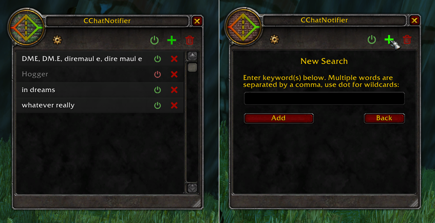
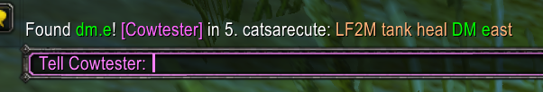

# CChatNotifier
A WoW Classic addon that can be used to filter chat for custom keywords. It will then notify you whenever it finds them in chat messages.

This is my minimalistic idea of a "LFG" addon. I don't want to look at chat 24/7 but also don't want to miss relevant messages. The more elaborate LFG addons are imho overkill, and at the same time not flexible enough, I don't need a list or anything, I just don't want to miss a message containing arbitrary things if it pops up. This solves that problem just fine, at least its ugly predecessor I had for vanilla pservers did.

## Features
* Create custom keyword groups to be looked for in chat (channels, say and yell).
* GUI to manage everything.
* If a word is found it will notify you in chat, optionally plays a sound too.
* Chat window for notification can be chosen, tab will flash when not shown.
* Name in notification can be clicked to open /whisper.
* Individual keyword groups or whole addon can be toggled on/off.

#### Note
Not tested in classic yet, notification sound probably throws an error, settings button texture probably missing. Otherwise *should* work. Will test and fix once I have access to the game again.